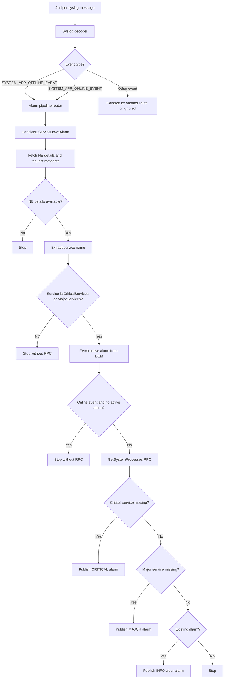

# NE Service Down Alarm Flow

This document explains how Juniper service lifecycle events are processed by the alarm pipeline.

## Purpose

The handler watches Juniper service events and creates or clears one consolidated NE Service Down alarm.

Only services in one of these maps should trigger the system-process RPC:

- `CriticalServices`: creates a `CRITICAL` alarm when missing.
- `MajorServices`: creates a `MAJOR` alarm when missing.

## End-to-End Flow



## Step-by-Step Behavior

### 1. Decode and route the event

The syslog decoder identifies service lifecycle messages such as:

- `App went offline re0-fibd`
- `App went online re0-fibd`

The pipeline routes offline and online events to `HandleNEServiceDownAlarm`.

### 2. Resolve the network element

The handler fetches:

- Network element information.
- Metadata required for switch API calls.

If either value is missing, processing stops and no RPC request is sent.

### 3. Extract and validate the service

The service name is extracted from the event. For example:

```text
App went offline re0-fibd
                          ^^^^
                        service
```

The service is then checked against both maps:

```text
if service is in CriticalServices:
    continue
else if service is in MajorServices:
    continue
else:
    stop without sending RPC
```

This prevents unrelated services from causing a `show system processes` request.

### 4. Read the existing BEM alarm

The handler queries BEM once for the active `NeServiceDownAlarm` and keeps its service list for both:

- Comparing a newly detected missing-service set.
- Deciding whether a clear event must be published.

Only `MAJOR` and `CRITICAL` BEM alarms are treated as active alarms.

### 5. Handle an online event with no active alarm

For an online event:

```text
if event is SYSTEM_APP_ONLINE_EVENT and no active BEM alarm exists:
    stop without sending RPC
```

There is no alarm to clear, so checking all system processes is unnecessary.

If an active BEM alarm exists, the flow continues to the RPC so the service state can be verified and the alarm can be cleared when appropriate.

### 6. Send the process RPC

For a monitored service event that passes the checks, the switch client sends the system-process request:

```json
{
  "command": "show system processes",
  "format": "json"
}
```

The response is converted into a set of running service names.

### 7. Build the consolidated alarm state

The handler checks all configured services, not only the service named in the event:

```text
missingCritical = CriticalServices - runningProcesses
missingMajor    = MajorServices - runningProcesses
```

The result is consolidated into one alarm:

- Any critical service missing: publish `CRITICAL`.
- No critical service missing but a major service missing: publish `MAJOR`.
- No monitored service missing: clear an existing alarm with `INFO`.

### 8. Avoid duplicate alarm events

Before publishing a new alarm, the handler compares the missing service set with the active BEM service list.

```text
if newMissingServices == existingBEMServices:
    stop without publishing a duplicate alarm
```

## Important Current Code Issue

The service-filter block currently contains unfinished pseudocode and will not compile until it is replaced with valid Go. The intended implementation shape is:

```go
serviceName := extractServiceNameFromMessage(syslogMsg.Message)
_, isCritical := CriticalServices[serviceName]
_, isMajor := MajorServices[serviceName]
if !isCritical && !isMajor {
    logger.Debugf("service %s is not monitored; skipping RPC", serviceName)
    return nil
}
```

The `extractServiceNameFromMessage` helper must also be implemented and tested for the actual Juniper message format.

## Example Outcomes

| Event | Service | Active BEM alarm | RPC sent? | Result |
|---|---|---:|---:|---|
| Offline | `fibd` | No | Yes | Evaluate all monitored processes; raise if services are missing |
| Offline | `ntpd` | No | Yes | Evaluate all monitored processes; raise if services are missing |
| Offline | `httpd` | No | No | Ignore unmonitored service |
| Online | `fibd` | No | No | Nothing exists to clear |
| Online | `fibd` | Yes | Yes | Verify processes and clear or update the alarm |
| Online | `httpd` | Yes | No | Ignore unmonitored service |

## Related Code

- `pkg/fixtures/alarms/pipeline/ne_service_down_alarm.go`
- `pkg/fixtures/alarms/pipeline/pipeline.go`
- `pkg/platform/decoder/syslog.go`
- `pkg/platform/decoder/events.go`
